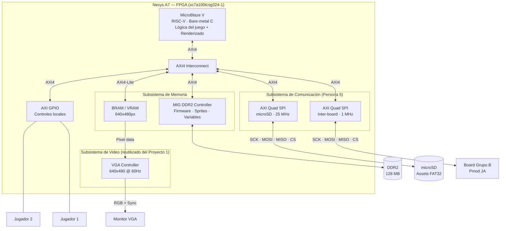

# Diagrama de Bloques — Sistema Embebido Multijugador sobre FPGA
**Proyecto 2 — EL3313 Taller de Diseño Digital, I Semestre 2026**
**Avance 1 — Semana 13**

---

## Diagrama general del sistema



---

## Descripción de bloques

| Bloque | Responsable | Descripción |
|---|---|---|
| **MicroBlaze V** | Persona 1 | Procesador RISC-V. Ejecuta el firmware en C: lógica del juego, renderizado a VRAM, coordinación de periféricos |
| **AXI4 Interconnect** | Persona 1 | Bus de comunicación interno. Conecta el procesador con todos los periféricos |
| **MIG DDR2** | Persona 2 | Controlador de memoria externa. Almacena firmware, sprites, variables del juego. Administrada manualmente sin OS |
| **BRAM / VRAM** | Persona 3 | Framebuffer de doble puerto. El procesador escribe píxeles (puerto A, 100 MHz) y el controlador VGA los lee (puerto B, 25 MHz) |
| **VGA Controller** | Persona 3 | Reutilizado del Proyecto 1. Genera señales de sincronía y lee la VRAM para producir la salida de video 640×480@60Hz |
| **Juego Pong** | Persona 4 | Lógica del juego en C: movimiento de bola, colisiones, puntaje, renderizado de escena a VRAM |
| **AXI Quad SPI (inter-board)** | Persona 5 | Comunicación SPI a 1 MHz con la board del grupo aliado. Intercambia estado del juego y posición de paleta remota |
| **AXI Quad SPI (microSD)** | Persona 5 | Carga de assets desde microSD al inicio del sistema. Lee sprites, fuente y configuración del juego vía FatFs |
| **AXI GPIO** | Persona 1 | Entradas de los dos controles locales (jugador 1 y jugador 2) |

---

## Flujo de datos principal

```
[Inicio]
  microSD ──(FatFs)──→ DDR2          Carga de sprites, fuente y config

[Game loop]
  GPIO ──────────────→ MicroBlaze    Lectura de controles locales
  SPI (Board B) ─────→ MicroBlaze    Recepción de posición paleta remota
  MicroBlaze ────────→ BRAM/VRAM     Renderizado: paletas, bola, puntaje
  BRAM/VRAM ─────────→ VGA → MON    Despliegue en pantalla (independiente del CPU)
  MicroBlaze ────────→ SPI (Board B) Envío de estado del juego al grupo aliado
```

---

## Distribución del trabajo

| Persona | Sección | Componentes |
|---|---|---|
| 1 | Procesador + Integración | MicroBlaze V, AXI Interconnect, GPIO, top-level, linker |
| 2 | Memoria DDR2 | MIG controller, mapa de memoria, administración manual |
| 3 | Sistema de Video | BRAM/VRAM, VGA Controller (adaptado de Proyecto 1), interfaz AXI4 |
| 4 | Juego Multijugador | Lógica Pong en C, colisiones, renderizado a VRAM |
| 5 | SPI + microSD | Protocolo SPI inter-board, driver microSD, carga de assets |

---

*EL3313 — I Semestre 2026 — Avance 1, Semana 13*
